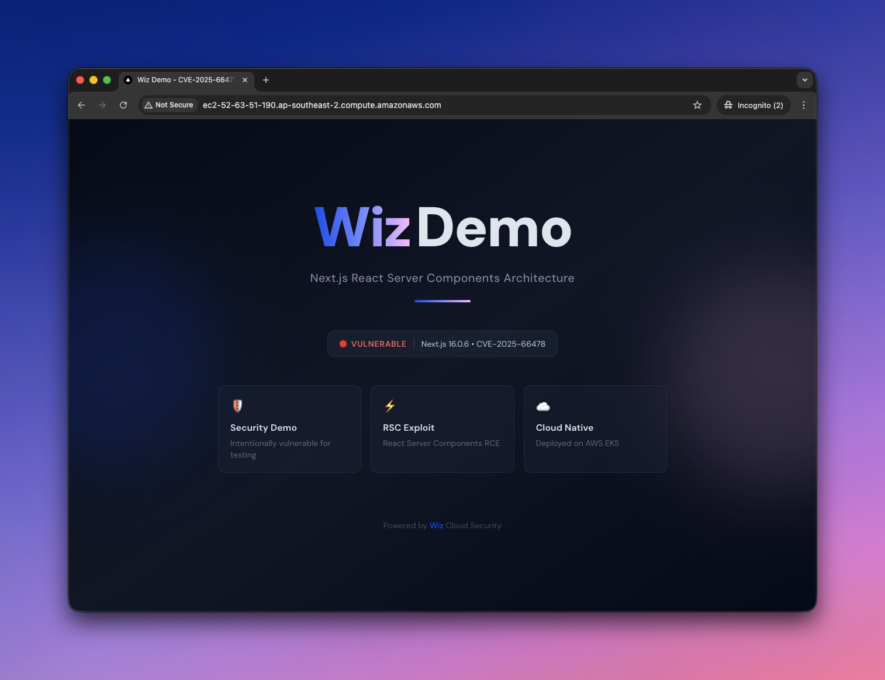
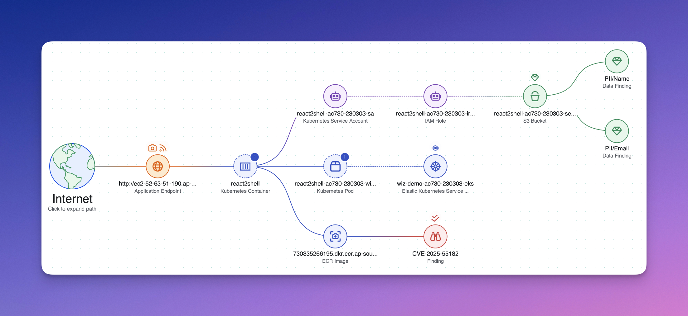
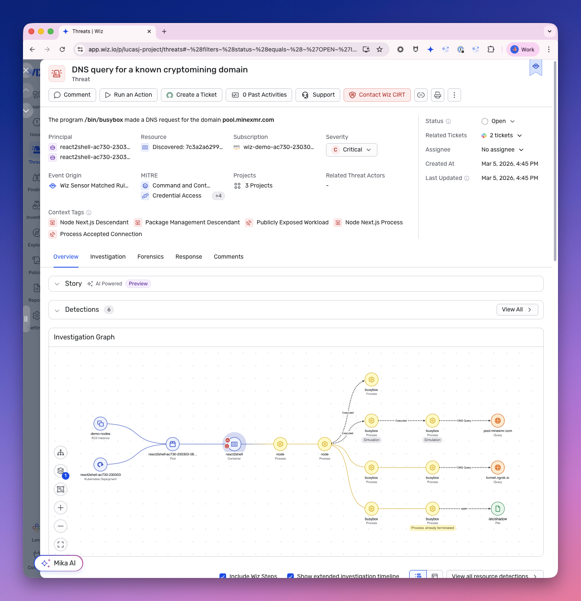
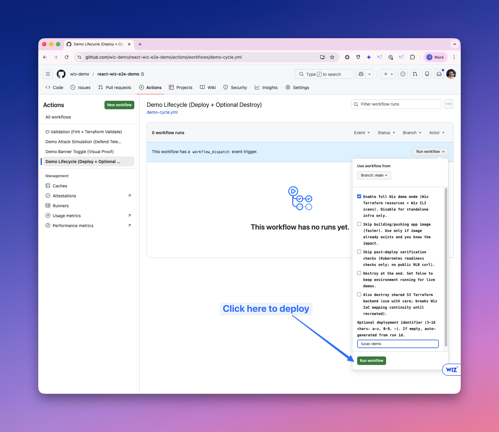
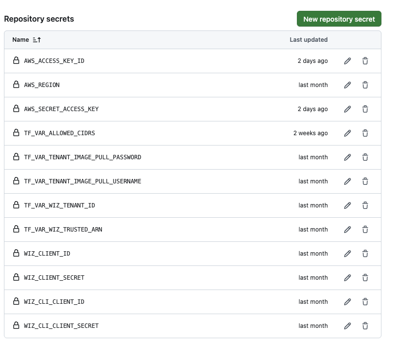

# wiz-react-e2e-demo

Purpose-built, repeatable **Wiz field demo** showing end-to-end security context across **Code, Cloud, and Runtime**.

It is designed for a deterministic demo cycle:

`deploy -> validate in Wiz -> simulate attack behavior -> destroy`

This repo intentionally deploys insecure infrastructure and a vulnerable app for demonstration/training only.

## Demo Preview







## Quick Start (Full E2E Demo)

Use this if you want a complete Code + Cloud + Runtime demo quickly.

1. In GitHub, use **Use this template** on this repo and create your own demo repo in your org.
2. Enable Actions in your new repo.
3. Configure secrets in your demo repo.
   Use `docs/SECRETS_SETUP.md` and start from the "Full Wiz demo (`enable_wiz=true`)" matrix.
4. **Add your repo to Wiz VCS integration.**
   In your Wiz tenant, go to **Settings → Integrations → Version Control** and add your newly created GitHub repo. This is required for IaC code-to-cloud mapping — without it, Wiz cannot read the `backend.tf` files that link Terraform state to deployed cloud resources.
5. (Optional for browser access) set `TF_VAR_allowed_cidrs` to include your source IP and any extra scanner CIDRs needed by your tenant.
6. In GitHub, run from `Actions -> Workflows -> Demo Lifecycle (Deploy + Optional Destroy) -> Run workflow`.
7. Set inputs and run with:
   `enable_wiz=true`, `destroy=false`, `skip_image=false`, `skip_verify=false`.

Run workflow example:



8. Validate in Wiz, then run `Actions -> Workflows -> Demo Attack Simulation (Defend Telemetry) -> Run workflow`.
9. (Optional) run `Actions -> Workflows -> Demo Banner Toggle (Visual Proof) -> Run workflow`.
10. Cleanup by rerunning `Demo Lifecycle (Deploy + Optional Destroy)` with `destroy=true`.

Important caveats:
- Initial AWS deployment commonly takes ~20-30 minutes, mostly due to EKS control plane/node group provisioning.
- Full Wiz reconciliation (especially IaC code-to-cloud and endpoint/resource linkage) is eventually consistent and can take up to ~24 hours in some tenants.
- Do not rely on passive discovery alone for endpoint mapping; generate real app traffic (browser requests and/or `attack-sim`) so Application Endpoints can correlate to workloads faster.

## What This Demo Highlights

- **Code -> Cloud mapping**: connect scanned IaC/code artifacts to deployed cloud resources
- **Cloud risk pathing**: show practical attack path context across exposure, workload, identity, and data
- **Runtime context**: generate sensor/attack-surface telemetry to enrich exposed endpoint and workload analysis
- **Operator workflow**: GitHub-first, repeatable process suitable for SE-led demos in throwaway lab accounts

## ⚠️ Security Warning

Do not deploy to production. This repo contains intentionally vulnerable code and over-permissive IAM policies.

## What It Demonstrates

- **Wiz Code**: IaC and dependency findings
- **Wiz Cloud**: toxic combinations path (public exposure -> vuln -> identity -> sensitive data)
- **Wiz Defend**: runtime detections (sensor + cloud logs)

## Golden Path

```
Internet -> NLB -> EKS Pod (RCE) -> IRSA -> IAM Role -> S3 Bucket (Sensitive Data)
```

## SE Runbook (GitHub-First, Recommended)

Use this when each SE runs the demo from their own GitHub repo in the org.

### Workflow quick map (for SEs)

- `CI Validation (Fmt + Terraform Validate)` (`.github/workflows/ci.yml`): PR/push checks only (no deploy, no destroy).
- `Demo Lifecycle (Deploy + Optional Destroy)` (`.github/workflows/demo-cycle.yml`): main deploy workflow.
- `Demo Attack Simulation (Defend Telemetry)` (`.github/workflows/attack-sim.yml`): generates runtime telemetry against an existing deployment.
- `Demo Banner Toggle (Visual Proof)` (`.github/workflows/attack-banner.yml`): set/reset UI banner for visual demo proof.

### SE account and cost guardrails

- Use your **Skilljar/lab AWS account** for this demo, not production or shared long-lived accounts.
- This environment creates paid resources (EKS, NLB, ECR, S3, scanning activity). Keep demos time-boxed.
- Always run the destroy step when finished (`demo-cycle` with `destroy=true`).
- Be careful with repeated parallel environments in one account; costs and quota pressure can rise quickly.

### 1. Create your own repo from template (recommended)

1. Open this repository in GitHub.
2. Click **Use this template**.
3. Create your new repo in your org.
4. In your repo, enable GitHub Actions.
5. Confirm Actions has permission to push commits on your branch (the workflow auto-syncs backend files and may commit drift).

GitHub CLI option:

```bash
gh repo create <org>/<your-demo-repo> --private --template <template-owner>/<template-repo>
```

### 2. Configure GitHub Secrets in your demo repo

Important:
- Secrets do **not** transfer when creating a new repo from template.
- Every SE must set secrets in their own GitHub repo/org before running workflows.
- Use `docs/SECRETS_SETUP.md` as the source of truth for required values by scenario.
- For local runs, start from `secrets.env.example` and create your own `secrets.env`.

GitHub Secrets example (repo `Settings -> Secrets and variables -> Actions`):



Required AWS secrets:
- `AWS_ACCESS_KEY_ID`
- `AWS_SECRET_ACCESS_KEY`
- `AWS_REGION`

Required when running with `enable_wiz=true`:
- `WIZ_CLIENT_ID`
- `WIZ_CLIENT_SECRET`

Optional but recommended for better Code-to-Cloud mapping:
- `WIZ_CLI_CLIENT_ID`
- `WIZ_CLI_CLIENT_SECRET`

Required for full wiz-enabled demo deployments (`enable_wiz=true`):
- `TF_VAR_wiz_tenant_id`
- `TF_VAR_wiz_trusted_arn`
- `TF_VAR_wiz_client_environment`
- `TF_VAR_tenant_image_pull_username`
- `TF_VAR_tenant_image_pull_password`

Required if you want direct browser access to the public frontend from your laptop:
- `TF_VAR_allowed_cidrs` (JSON list string, for example `["203.0.113.10/32"]`) for additional allow-list CIDRs in app NetworkPolicy (typically your source IP). This list can also include Wiz scanner CIDRs when needed.

Only truly optional for reduced-fidelity runs:
- If running `enable_wiz=false`, the Wiz `TF_VAR_*` values above are not required.
- If you do not need direct browser access, `TF_VAR_allowed_cidrs` can be omitted.
- The demo also includes a default Wiz scanner CIDR list via `TF_VAR_dynamic_scanner_ipv4s_develop`; if your tenant uses different scanner IPs, override that variable and/or add CIDRs via `TF_VAR_allowed_cidrs`.

### 3. Add your repo to Wiz VCS integration

In your Wiz tenant, go to **Settings → Integrations → Version Control** and add your newly created GitHub repo. This is required for IaC code-to-cloud mapping — without it, Wiz cannot read the `backend.tf` files that link Terraform state to deployed cloud resources.

If your org already has a GitHub integration configured in Wiz, you may just need to ensure the new repo is included in the scan scope (e.g. by adding the repo or org-wide access).

### 4. Deploy from Actions

Run workflow: `.github/workflows/demo-cycle.yml`

GitHub UI path:
1. Open your repo in GitHub.
2. Click `Actions`.
3. Select `Demo Lifecycle (Deploy + Optional Destroy)`.
4. Click `Run workflow`.
5. Select branch (usually `main`), set inputs, then click `Run workflow` to start.

Example:


Input behavior to remember:
- `destroy=false` keeps the environment running for live demos.
- `destroy=true` cleans up at end of run.
- Default is now `destroy=false` in the workflow UI.
- Plan for ~20-30 minutes on first deploy in a fresh AWS account because EKS creation dominates runtime.

Recommended fresh-account sequence:
1. Run `demo-cycle` with `enable_wiz=false`, `destroy=true` to validate AWS/account wiring.
2. Run `demo-cycle` with `enable_wiz=true`, `destroy=false` to leave the environment up for Wiz validation.
3. Optionally set `deployment_name` for deterministic naming. If omitted, the workflow auto-generates one.

### 5. Generate runtime telemetry

Run workflow: `.github/workflows/attack-sim.yml`

GitHub UI path:
1. `Actions -> Demo Attack Simulation (Defend Telemetry) -> Run workflow`
2. Select branch/inputs and run.

- Use matching `enable_wiz` mode.
- This workflow assumes environment is already deployed.
- It runs exploit simulation through `kubectl port-forward` (runner-independent).

### 5a. Run the banner workflow (safe visual proof)

Run workflow: `.github/workflows/attack-banner.yml`

GitHub UI path:
1. `Actions -> Demo Banner Toggle (Visual Proof) -> Run workflow`
2. Select branch/inputs and run.

Use this when you want a visible app defacement-style demo without running the full exploit sequence.

Recommended inputs:
- `enable_wiz`: match how the environment was deployed
- `backend_branch`: `main` (unless you intentionally used a different backend branch)
- `reset_banner`: `false`
- `banner_message`: your demo text (example: `COMPROMISED`)
- `local_port`: keep default unless port conflict

To revert after demo, run `attack-banner` again with:
- `reset_banner=true`

This workflow assumes environment is already deployed and uses `kubectl port-forward` from the runner.

### 5b. Access the web frontend yourself

To access the app from your own browser, your public source IP must be allowed by Kubernetes NetworkPolicy.

NetworkPolicy allow-list effective set:
- Default Wiz scanner CIDRs (from `TF_VAR_dynamic_scanner_ipv4s_develop`)
- Plus `TF_VAR_allowed_cidrs` (operator IPs and any extra scanner CIDRs you add)

GitHub Actions path:
- Set `TF_VAR_allowed_cidrs` secret in your demo repo (example: `["203.0.113.10/32"]`)
- Re-run `demo-cycle` deploy with that secret present

Local path:
- Set `AUTO_DETECT_PUBLIC_IP=true` before `mise run deploy-demo`, or set `TF_VAR_allowed_cidrs` directly

If source IP allow-listing is missing, the NLB may resolve and health checks may pass, but browser access can still fail from your laptop.

### 6. Destroy cleanly

When validation is done, run `demo-cycle` with:
- `enable_wiz=true`
- `destroy=true`
- `deployment_name=<same deployment name used for deploy>`

Do not set `destroy_backend=true` unless you intentionally want to delete the shared Terraform backend bucket.

## What SEs Should Expect in Wiz

### Expected demo objects

After `demo-cycle` (`enable_wiz=true`, `destroy=false`) and `attack-sim`, you should expect to see:

- Cloud resources for the AWS account (EKS, ECR, IAM, S3, NLB, k8s resources)
- Wiz Code findings for this repo
- Container image findings for the pushed ECR image tag/digest
- Runtime Sensor deployment visible and healthy
- Application Endpoint objects for internet-facing entry points

### Expected code-to-cloud and endpoint behavior

- Kubernetes workloads may show as `*-wiz-representative` resources. This is expected for ephemeral workloads.
- Container cloud-to-code mapping can appear before endpoint-to-container linkage.
- App Endpoint objects can initially be `scanSources=["CLOUD"]` with `resources=null`, then later enrich with linked resources after additional scan/reconciliation cycles.

### Reconciliation timing (important)

This demo is eventually consistent across multiple pipelines. Delays are normal.

- IaC code-to-cloud mapping:
  - Depends on backend state visibility and ingestion.
  - Keep backend metadata in git and keep backend bucket retained (`destroy_backend=false`).
  - May take additional connector scan cycles after deploy before full links appear (in some tenants, allow up to ~24 hours).
- Application Endpoint to container mapping:
  - Depends on Attack Surface scan + runtime/cloud correlation.
  - Often lags behind initial cloud endpoint discovery.
  - Manual endpoint/connector rescans and fresh traffic can accelerate refresh, but not always instantly.
  - Expect weaker linkage if the app has little/no live traffic; generate real requests to the endpoint during validation.

## Important Mapping Notes

- Keep Terraform backend metadata explicit and in sync (`bucket`, `key`, `region`, `encrypt`, `use_lockfile`) to support Wiz IaC code-to-cloud mapping.
- Keep backend bucket retention default (`destroy_backend=false`) to preserve mapping continuity.
- Container cloud-to-code mapping requires image scan + tag (`wizcli scan container-image` and `wizcli tag`) for the pushed digest.
- Seeing `*-wiz-representative` Kubernetes container/pod resources is expected behavior in Wiz for ephemeral workloads.
- Endpoint-to-container edges can lag scan cycles even when sensors are healthy. Validate both endpoint `scanSources` and endpoint `resources` linkage in Wiz.

## Layout (Important Bits)

- `infrastructure/demo/`: wiz-enabled Terraform root
- `infrastructure/demo-nowiz/`: standalone/no-wiz Terraform root
- `infrastructure/backends/`: Terraform bootstrap for S3 state backend
- `modules/`: supporting Terraform modules
- `scenarios/react2shell/aws/`: vulnerable app module + demo data
- `.github/workflows/`: GitHub Actions workflows
- `docs/GITHUB_ACTIONS.md`: workflow reference
- `docs/WORKLOG.md`: implementation notes and troubleshooting history

## More Detail

For full workflow behavior and inputs, see `docs/GITHUB_ACTIONS.md`.
